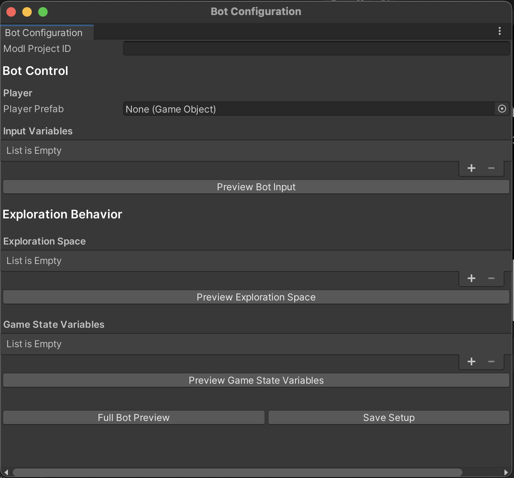
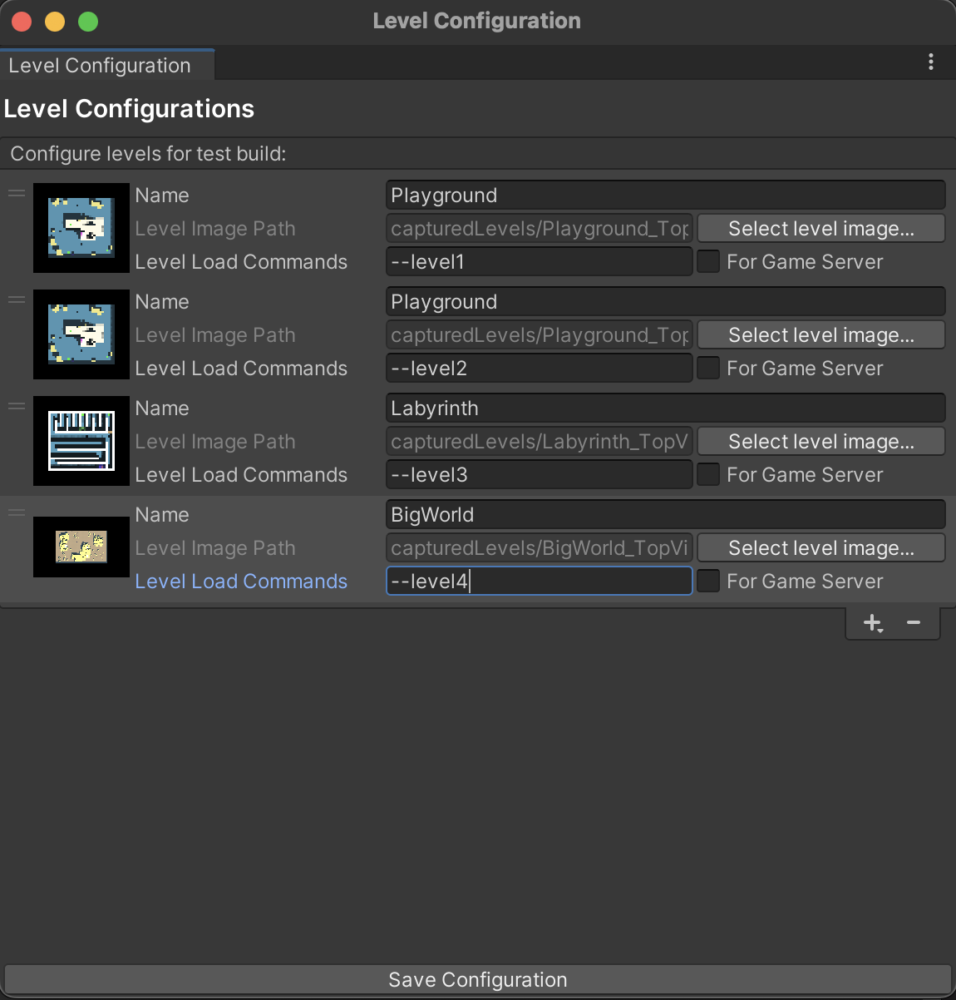
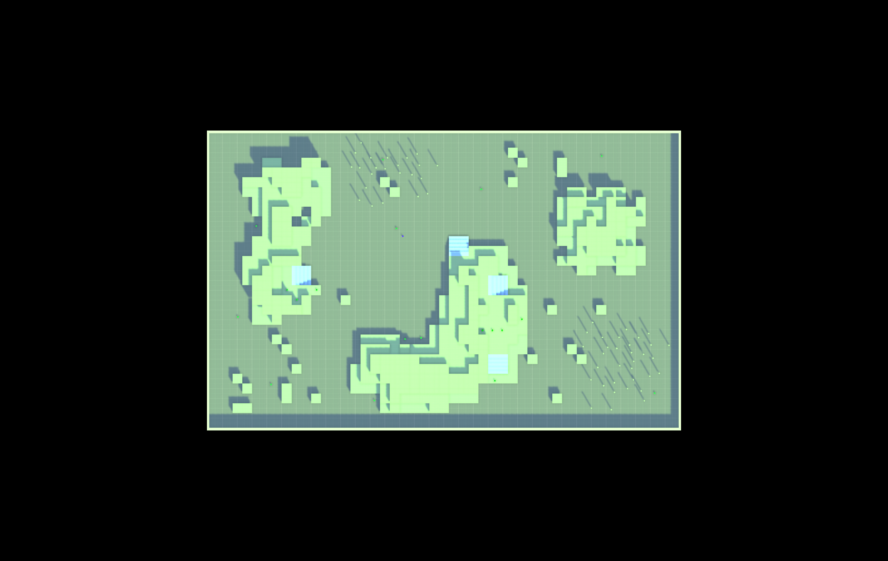
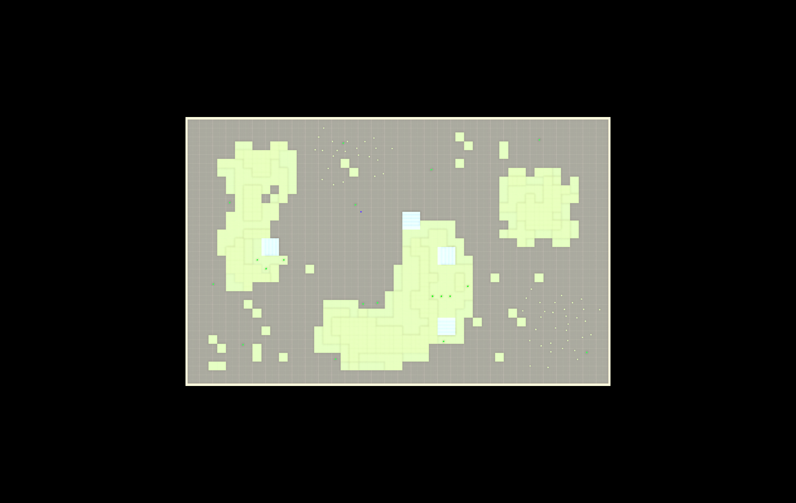

# Unity Plugin Manual {#unity_manual}
[TOC]

## Contents
- [Get started with modl:test for Unity](#get-started-with-modltest-for-unity)
- [Install and enable modl:test](#install-and-enable-modltest)
- [Configure your project for modl:test](#configure-your-project-for-modltest)
- [Bot configuration](#bot-configuration) 
- [Level configuration](#level-configuration)
- [Use modl:test features in your project](#use-modltest-features-in-your-project)

----
## Get started with modl:test for Unity

modl:test is an automatic game testing solution powered by the modl AI engine.

You can use the modl:test plugin to configure a bot to explore and interact with your game. If you have configured a bot and levels, go to the modl.ai platform to manage your test reports. To get to the modl platform from Unity, go to **modl** > **modl:test platform**.


The table below details the different information modl:test can report on: 


|Information type|Description|
|:---|:---|
|Errors|Error messages logged by Debug.LogError in the console log.|
|Exceptions|Exceptions logged in the console log.|
|Crashes|Events in which the game crashes.|
|Custom events |Events logged by `Modl.EventReporter.Report`. For more information, refer to [Use custom events](#use-custom-events).|
|Bot’s actions|Actions that the bot takes during a test run.|
|Bot’s position|Positions the bot has visited during a test run.|
|Game state |Variables that you want to track during a test run. |
---


## Technical details

The modl:test plugin is compatible with the following Unity specifications: 


|Type|Compatibility|
|:---|:---|
|Unity version|2019.4+|
|Editor platforms| - Windows <br/>- Linux<br/>- macOS (Intel only)<br/>|
|Render Pipelines|- Built-in<br/>- URP <br/>- HDRP|
|Scripting Backends|Mono|


## Set up a modl account

You can install and preview the modl:test plugin without a modl.ai account but you need an account to run tests on the modl.ai platform. To request an account, fill in the [modl.ai signup form](https://modl.ai/sales-signup/).  

---
# Install and enable modl:test 

You can install the modl:test package through the Unity Asset Store or via the Package Manager.

For more information, go to the Installation Instructions page.

## Enable modl:test

You need to enable modl:test if you want to use modl’s automatic testing at any point in your game. 

To enable modl:test, go to **modl** and select **Toggle modl Testing**. A tick appears to show that you've enabled modl:test.

You can also build your game without including modl:test code. To remove modl:test code from your project, turn off **Toggle modl Testing**.

---
# Configure your project for modl:test

Each game is different, so you need to configure aspects of your project to work with modl:test. To do this, use the `MODL_AUTOMATIC_TESTING` scripting define to wrap any code you want to enable or disable. 

You can also remove modl:test from your build entirely if you don’t want to include any modl functionality in your release build. For further information, refer to [Enable modl:test](#enable-modltest).

Make sure your project includes the following: 

- Code to start modl:test. For further information, refer to [Start modl:test](#start-modltest).
- Code to allow modl:test to override your game code. For more information, refer to [Configure your code for modl:test](#configure-your-code-for-modltest).
- Code that tells the modl.ai platform which of your level’s to load. For more information, refer to [Test multiple builds in one scene](#test-multiple-scenes-in-one-build).


If you want to configure a bot and levels in your project, refer to [Configure an exploratory bot](#bot-configuration) and [Level configuration](#level-configuration).


## Start modl:test

Start modl:test from your code to begin automated testing and allow the modl AI engine to operate your game. You need to call the modl:test start code at least once in your project.

To start modl:test, add the following code to any component loaded with your scene: 


```
{
#if MODL_AUTOMATIC_TESTING
    if (!ModlPublicController.IsTransmitting)
    {
        ModlPublicController.Start();
    }
#endif
}
```


You can also create a component or game object specifically to start modl:test in your project.


## Configure your code for modl:test

Make sure your bot can explore your game with minimal friction by telling modl to ignore any code that doesn’t apply to automatic test processes. You can also add code that only applies your modl testing process, such as custom events. To do this, use the `MODL_AUTOMATIC_TESTING` scripting define. 

For example, to allow modl:test to control your game’s input you might need to disable your input code in the following way: 


```
void Update()
{
#if !MODL_AUTOMATIC_TESTING
    m_Movement.Set(Input.GetAxis("Horizontal"), Input.GetAxis("Vertical"));
    m_Camera.Set(Input.GetAxis("Mouse X"), Input.GetAxis("Mouse Y"));
    m_Jump = Input.GetButton("Jump");
#endif
}
```


### Object cleanup

If your game destroys all the game objects in your scene at any point, you need to add an exception for any object you want modl to continue to track. To add an exception, use the `MODL_AUTOMATIC_TESTING` to wrap your object cleanup code. 


## Test multiple scenes in one build

If you want to test multiple scenes in one build on the modl.ai platform, you need tell modl:test how to load these scenes.

To do this, use your level select scene or create a scene that you can use to load other scenes. Then, add a script that can parse command line arguments.

For an example of how parse command line arguments in a script, refer to following the code snippet:


```
private void Awake()
{
    if (Environment.CommandLine.Contains("--Level1"))
    {
        SceneManager.LoadScene("Level1");
    }
    else if (Environment.CommandLine.Contains("--Level2"))
    {
        SceneManager.LoadScene("Level2");
    }
    else if (Environment.CommandLine.Contains("--Level3"))
    {
        SceneManager.LoadScene("Level3");
    }
}
```


For information on how to configure command line arguments to load your levels, refer to [Level configuration](#level-configuration).

---
# Bot configuration 

A bot represents a player that explores your levels during test runs. To use a bot in your project you need to assign a player prefab for modl to control as your bot, define input variables and configure the exploration space within your game. The modl:test plugin provides the exploratory algorithm for your bot to use. 

The information below describes the properties in the bot configuration window and how to configure a bot. 


## The bot configuration window 

To open the bot configuration window, go to **modl** > **Bot Configuration**. The table below describes the properties in the window and how to use them: 




|Section|Property|Description|
|:---|:---|:----|
||modl Project ID (Asset Store only)| Add your project ID. You can find your project ID in the modl.ai platform URL after. |
|Bot Control||Configure your bot, assign input variables and start a preview. |
||Player|Select a Player prefab from your game as the bot. |
 ||Input variables|Select input variables that you want modl to use to operate your bot. |
||Preview Bot Input |Preview modl:test operating your with the input variables you defined. |
|Exploration Behavior||Configure and preview the classes you want modl:test to report on. |
||Exploration space|Configure an exploration space for the bot to explore. The exploration space defines what you want the bot to explore and how modl:test knows if your bot reaches a new state. The bot tries to reach as many different exploration states as possible.  
 ||Interval|Adjust how many Unity units modl:test counts as a game state. <br/> During test runs, your bot compares two recorded game states and determines if they are different based on the interval size you set. One interval is one Unity unit. |
 ||Preview Exploration Space |Preview your bot in the exploration space. |  
 |Game State Variables ||Add the classes and parameters you want modl:test to report on and restore within a game state. For example, if you want to receive more detailed information about where the bot has been in your level, add the player position class. <br/>You must add any variables you’ve defined in the exploration space. <br/> Enable **Read Only** if you want to track a property for reporting but don’t want to reset the same property when modl restores the game state. <br/>You must not enable **Read Only** on any game state variables that control exploration, such as position. |
||Preview Game State Variables|Preview your game reloading into previous states. Manually move your character around the scene to record game states and observe if modl resets your tracked variables as expected. |
||Full Bot Preview|Preview your bot configuration. In-editor modl testing uses a random exploration to preview your configuration. To use the AI exploration, upload your build to the modl.ai platform. Make sure you can see your bot moving around and game states reloading. |
|Save Setup ||Save your configuration settings. |


## Configure an exploratory bot 

To assign a bot, add input variables, configure the exploration space and configure any game state variables in your project, use the following steps: 

1. Go to **modl** > **Bot Configuration**
2. Fill in the **ProjectID** field. 
3. In **Player** > **Player Prefab**, add your player prefab. Your player becomes your modl:test exploratory bot. 
4. In **Input Variables**, select **+** to add any input class that you want modl to use to operate your bot.   
5. In **Exploration Behavior** > **Exploration Space**, select **+** to add any variables that you want modl:test to track and report on. 
6. In **Game** **State** **Variables**, select **+** to add any variables that you want modl:test to keep track of and record in the exploration data.
7. Select **Preview Bot Input** to check that modl:test can operate your bot. Your bot should move using your chosen input variables.
8. Select **Preview Exploration Space** to check if modl:test is previewing reporting behavior. Your bot should move and your console should output observations. 
9. Select **Preview** **Game State Variables** to check if the game states reload with the variables you chose. 
10. Select **Full Bot Preview** to allow your project to preview all of your bot configuration settings. **Note**: preview behavior uses a random exploration. You need to upload your build to the modl platform to use AI exploration.  
11. Select **Save Setup** to save your configuration settings. 

If you notice that your bot isn’t moving in preview, make sure your input code includes the `MODL_AUTOMATIC_TESTING` scripting define to allow modl:test to control your bot. For more information, refer to [Configure your code for modl:test](#configure-your-code-for-modltest).

# Level Configuration

modl:test plots your bot’s movements onto an image of your level that you receive with your report. 

When you upload a build to the modl platform, each level needs to include an image and a level load command line argument.

**Note**: If your game uses a client / server setup and the server controls how your game’s levels are loaded, enable `For Game Server`. 




There are three ways to capture a level image: 

* Capture an image of all the scenes in build settings. 
* Capture an image for one scene.
* Capture a custom image. 


## Capture all of the scenes in build settings 

You can capture images for all of the scenes in your build settings. If you don’t use scenes to load your levels you need to use semi-automatic capturing to capture one image at a time for each scene. For more information refer to [Capture an image for one scene](#capture-an-image-for-one-scene). 

To capture an image for all of the scenes in the build settings window, use the following the steps: 

1. Add your scenes to your project’s build settings. 
2. Go to **modl** > **Level Configuration**.
3. Select **+** 
4. Choose **Capture All Scenes in the Build Settings** 
5. Choose a lighting type and pixel density for your image. For more information about lighting type options, refer to [Choose a lighting type](#choose-a-lighting-type). 
6. modl:test captures an image for each scene in the build settings and presents it in the **Level Configuration** window. 
7. For each image, go to **Level Load Commands** and add a command line argument to tell the modl.ai platform which level to load. For an example of a level load script, refer to [Test multiple scenes in one build](#test-multiple-scenes-in-one-build). 


## Capture an image for one scene 

To capture an image for one scene at a time in your project, use the following steps: 

1. Load the scene you want to capture an image for. 
2. Go to **modl** > **Level Configuration**.
3. Select **+** 
4. Choose **Capture Current Scene**.
5. Choose a lighting type and pixel density for your image. For more information about lighting type options, refer to [Choose a lighting type](#choose-a-lighting-type). 
6. modl:test captures an image of the current scene and presents it in the **Level Configuration** window.
7. Go to **Level Load Commands** and add a command line argument to tell the modl.ai platform which level to load. For more information, refer to [Test multiple scenes in one build](#test-multiple-scenes-in-one-build).


## Capture a custom image

If you don’t want to use automated capturing to capture a level image, you can use the **Level Image Capturing** window to capture a custom image.  Capturing a custom image is useful if you want to capture specific aspects of a level or a large level image.

To capture and customize an image with the **Level Image Capturing** window, use the following steps: 

1. Go to **modl** > **Level Utils**> **Capture Custom Level Image or Section** 
2. In the **Level Image Capturing** window, use the **View Direction**, **Orthographic size** and **Offset** to position and capture your level.  The **Level Image Capturing** window inherits from the scene view window. The scene view gizmos can be ignored.
3. Enter a level name. 
4. Select **Capture**
5. If you want to capture and merge multiple images, select **Auto Merge Captured Sections**. 
    1. If you want to manually merge images, use the following steps: 
        1. go to **modl** > **Level Utlis** > **Merge Captured Level Sections**. 
        2. Select the images you want to merge. 
        3. Name your merged level.
        4. Select **Merge all selected files** 

You must add your level images to the **Level Configuration** window. To do this, use the following steps: 

1. Go to  **modl** > **Level Configuration**
2. Select **+**
3. Select **Add Empty Row**
4. Add a level name
5. Select **Select Level Image** 
6. Choose a level image 
7. For each image, go to **Level Load Commands** and add a command line argument to tell the modl.ai platform which level to load. 

## Choose a lighting type

When you capture an image, you can select a lighting type so that you can choose how you see your level in the platform reports. You can also choose a pixel density and resolution size, which sets the quality of the image. 

You can choose to use the in-game lighting or the scene view lighting. 

Choose **Using in Game Lighting** to capture an image using the lighting setup in the scene. The following image shows an example of an image captured with in-game lighting:




Choose **Using Scene View Lighting** to capture an image with a direct light added to the camera. The camera light illuminates the scene from above. The following image shows an example of an image captured with scene view lighting:



---
# Use modl:test features in your project 

You can use modl:test features to customize and optimize your test runs. 

The table below describes modl:test features and what they do: 

|Feature|Description|
|:----|:----|
|Terminal states |Deter a bot from loading a game state again. |
|Waypoints|Encourage your bot towards a predefined point. |
|Custom events |Track specific events in your game. |
|Checkpoints |Clear the previous state your bot has explored.|

## Use terminal states

During exploration, your bot regularly reloads the game state to previously observed states. If you have states that you don’t want your bot to explore, mark those states as `Terminal`. If your bot enters a terminal state, modl:test will force your bot to restart exploration in a different state. 

Use the following code to implement terminal states in your project: 


```
void Update()
{
    if(GameOver())
    {
#if MODL_AUTOMATIC_TESTING
        ModlPublicController.InvokeTerminalStateUpdate();
#else
        ShowGameOverScreen();
#endif
    }
}
```

## Use waypoints

A modl:test waypoint is a prefab that your bot moves towards whilst exploring. If you have multiple waypoints in your project, you need to track each waypoint’s index as a game state variable. You can use the waypoint index in your test reports to find out which order the bot tried to reach the waypoints. You can also define the order in which your bot visits waypoints. To do this, go to the waypoint's inspector and set the index number.

To add a waypoint in your project, use the following steps: 

1. Go to `ai.modl.engine/Runtime/Resources/`
2. Drag the waypoint prefab into your scene and position it. 
3. Go to **modl** > **Bot Configuration.**
4. In **Game State Variables**, add the waypoint prefab. Make sure you track the waypoint transform and index. 

## Use custom events

A custom event enables you to record specific events in your project. The modl.ai platform adds any custom events to your test report. 

You can use custom events throughout your project but some common use cases are: 

* Level finish
* Item pickup 
* Checkpoints 
* Player out of bounds 

To implement a custom event in your project, use `Modl.EventReporter.Report("youreventhere"); `.

To implement a player out of bounds custom event, complete the following steps: 

1. Add a collider to catch your bot outside of the boundaries of your game. 
2. Call `Modl.EventReporter.Report("OutOfBounds");` when the player hits the collider.

## Stop your bot from re-exploring previous states

If you want your bot to avoid re-exploring a previous state, create a custom event and use the `MODL::STATE_ARCHIVE_CLEAR` keyword. To implement this in your game, add `Modl.EventReporter.Report("MODL::STATE_ARCHIVE_CLEAR")` to any scene you want to clear.
It is best practice to use `MODL::STATE_ARCHIVE_CLEAR` if a part of your level becomes unreachable. For example, if a door closes and stops the player from backtracking.

**Note:** The keyword changed in version 3.1.0. If you’re using an older version of the modl Unity plugin, you need to use the `checkpoint` keyword instead. To implement checkpoints in your game, add `Modl.EventReporter.Report("checkpoint")` to any scene you want to clear. Avoid naming your events checkpoint unless you want to use this feature. Checkpoints force modl:test to clear all previously explored states.


---
# Troubleshooting 

**My Player isn’t being detected**

Make sure your player prefab is added to the Player prefab field in the Bot Configuration window. For more information, refer to [Bot configuration](#bot-configuration).

**The video shows my bot exploring the wrong level**

Add command line args to the levels for loading into the scene

**My project has errors about `Microsoft.GeneratedCode`**

In your project directory, delete all folder with generated code. This can include everything except `Assets/`, `Packages/`, and `ProjectSettings/`.

**Unity keeps prompting me to save my scene while using the modl plugin, even when I haven't edited the scene.**

If you haven’t made any changes to your scene, you can select **Don’t Save**. The modl:test plugin stores any **Bot Configuration** changes in your scene’s undo stack, which marks your scene as dirty. 


